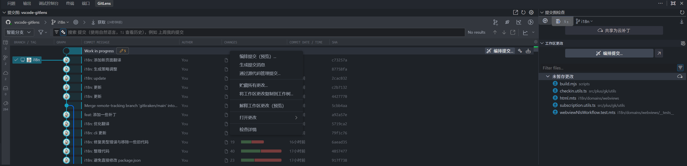
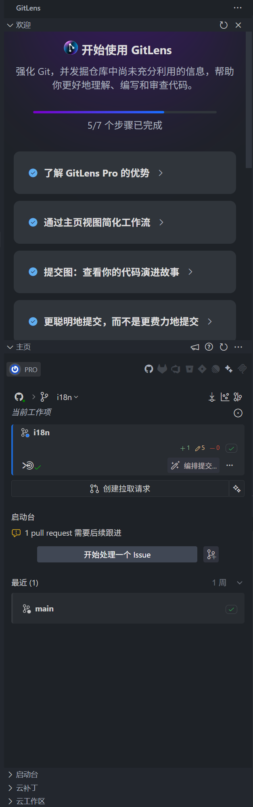
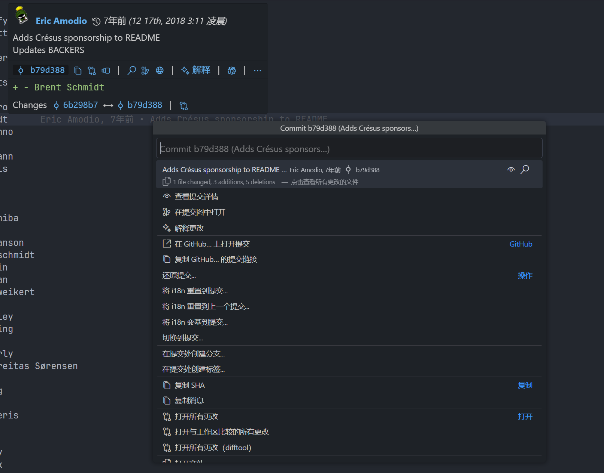

# GitLens 中文 i18n 分支

这是 GitLens 的中文本地化分支，目标是在尽量少改动上游源码的前提下，为 GitLens 提供中文界面与相关文案。本分支基于上游 [gitkraken/vscode-gitlens](https://github.com/gitkraken/vscode-gitlens) 持续同步，中文本地化维护源与工作流主要位于 `i18n/`；运行时与 VS Code 需要消费的本地化资源由编译/打包流程生成。

使用编译期生成方案，在`git`上对上游`./src`与`package.json`的更改为0，这允许我们能够持续合并上游更改。

> [!WARNING]
> 不对翻译精确性负责, 目前 99% 翻译由 `gpt-5.5 xhigh` 根据上下文翻译与自校对, 一些小众危险操作前最好看下英文原意.

## 效果预览







## 环境要求

参考上游安装要求

## 拉取源码

首次拉取中文 i18n 分支：

```bash
git clone -b i18n https://github.com/xuhuanzy/vscode-gitlens-zh.git
cd vscode-gitlens-zh
```

如果你已经克隆过仓库，只需要切换并更新 `i18n` 分支：

```bash
git fetch origin
git switch i18n
git pull --ff-only origin i18n
```

## 安装依赖

```bash
pnpm install
```

依赖安装后，可以先运行一次快速编译确认开发构建正常：

```bash
pnpm run build:quick
```

注意：`pnpm run build:quick` 会生成并编译 runtime dynamic 与 webviews 的中文运行时产物，但不会生成扩展所需的 `package.json` / `package.nls*.json`，因此它不是完整中文安装包的打包步骤。

## 编译与打包

生成完整中文 VSIX 扩展包：

```bash
node ./i18n/cli.mts manifest package
```

这个命令会先运行生产构建，再生成 staged `package.json`、`package.nls.json`、`package.nls.zh-cn.json`，最后从 `.work/i18n/extension-root/zh-cn` 这个编译期生成的目录打包 VSIX。

打包成功后，VSIX 默认位于 `.work/i18n/extension-root/zh-cn` 目录下，文件名类似 `gitlens-17.12.0.vsix`。

### gitlens pro

生成完整中文 VSIX 扩展包前执行

```bash
git apply .github/patch/pro.patch
```

## 安装到 VS Code

以在 VS Code 中安装：

1. 打开 Extensions 视图
2. 点击右上角 `...`
3. 选择 `Install from VSIX...`
4. 选择刚生成或下载的 `.vsix` 文件

安装后建议重新加载 VS Code 窗口，确保扩展使用最新构建。

## 开发与翻译

本项目的本地化工作流、脚本维护、报告生成与源码集成主要由 `codex` 负责。

用户侧通常只需要关注译文质量：根据专业语境校对、修订和补充权威翻译内容，即修改 `i18n/authority/zh-cn` 下的权威翻译文件。

其他 `i18n` 目录内容属于工作流、生成数据或校验材料，除非明确知道影响范围，否则建议交由 `codex` 处理。

## 常用命令

```bash
pnpm install          # 安装依赖
pnpm run build:quick  # 快速开发构建, 不生成完整中文 VSIX
pnpm run build        # 完整构建
node ./i18n/cli.mts manifest package  # 生成完整中文 VSIX
pnpm run test         # 运行单元测试
```
